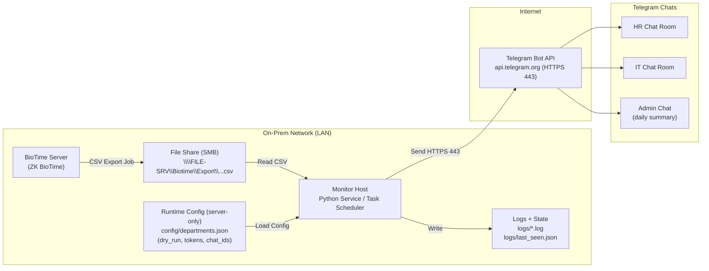
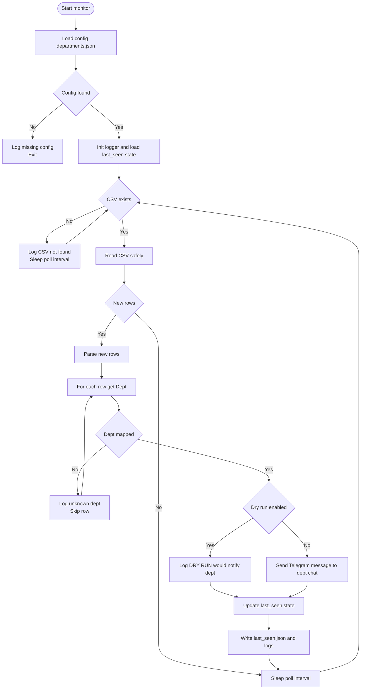
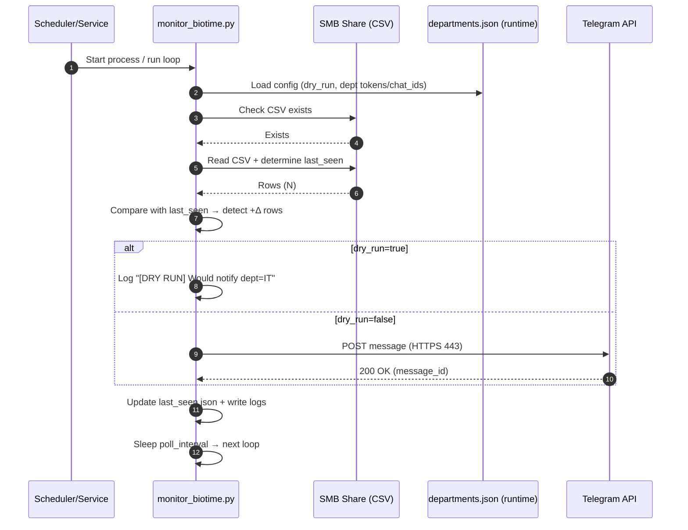
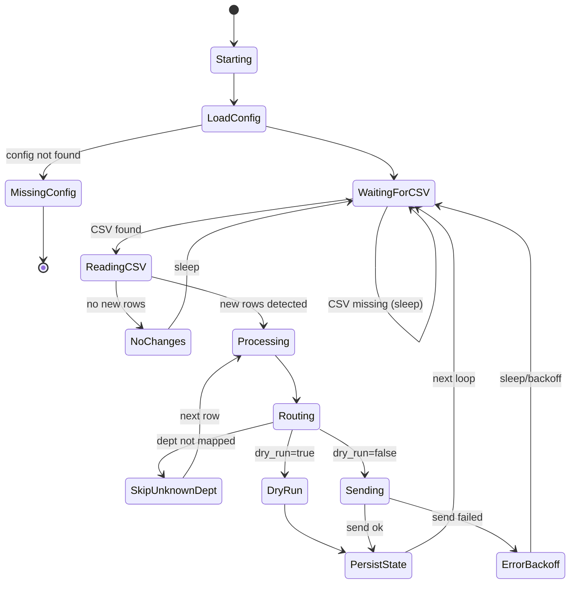

# Diagrams — BioTime → Telegram Alert System

All diagrams are **sanitized** (placeholders only).  
Use these for portfolio / recruiters / ops handover.

---

## 1) High-level Architecture (System Context)

## 2) Flowchart — Monitoring Logic (Polling / Routing / DRY RUN)

## 3) Sequence Diagram — “New row detected → Telegram notify”

## 4) State Diagram — Runtime behavior (safe + ops-friendly)

## Notes (Sanitization)
- Use placeholders only (FILE-SRV / sample paths / no real tokens)
- Real tokens/chat IDs must live only in config/departments.json (not committed)

