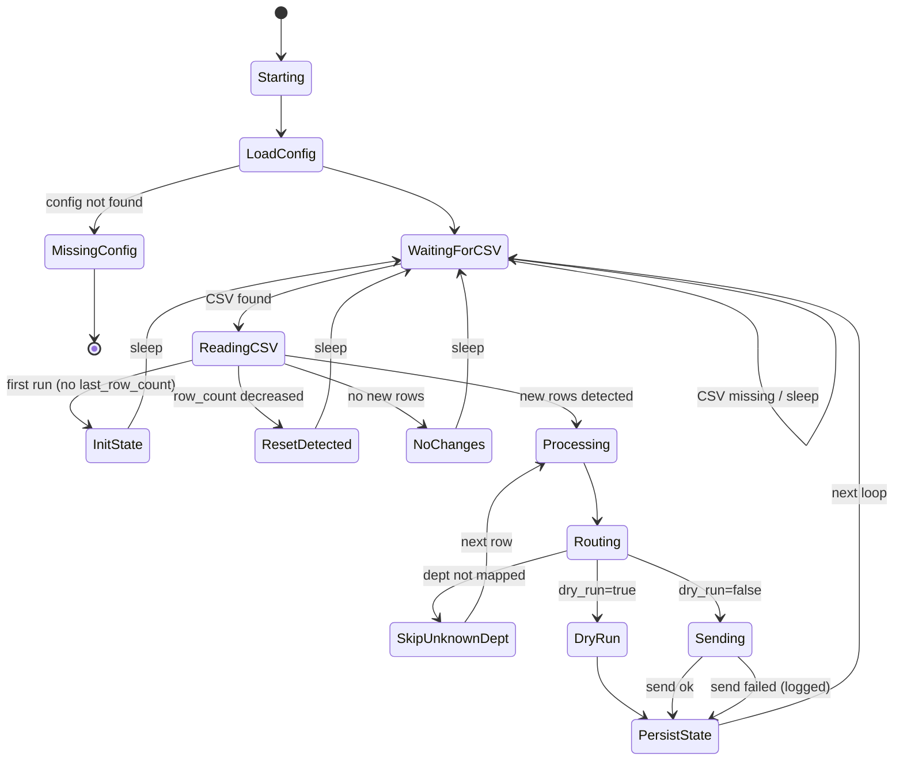

# Diagrams — BioTime → Telegram Alert System

All diagrams are **sanitized** (placeholders only).  
Use these for portfolio / recruiters / ops handover.

---

## 1) High-level Architecture (System Context)


## 2) Flowchart — Monitoring Logic (Polling / Routing / DRY RUN)

```mermaid
   flowchart TD
    A([Start monitor]) --> B[Load config: config/departments.json]
    B --> C{Config found?}
    C -- No --> C1[Log missing config<br/>Exit]
    C -- Yes --> D[Load last_seen state (logs/last_seen.json)]

    D --> E{CSV exists?}
    E -- No --> E1[Log CSV not found<br/>Sleep poll interval] --> E
    E -- Yes --> F[Read CSV (encoding fallback)]

    F --> G{First run? (no last_row_count)}
    G -- Yes --> G1[Initialize state = current row_count<br/>(avoid spamming old rows)] --> H[Sleep poll interval] --> E
    G -- No --> I{row_count decreased?}
    I -- Yes --> I1[CSV reset/rotated<br/>Update state to new row_count] --> H --> E
    I -- No --> J{New rows appended?}
    J -- No --> H --> E
    J -- Yes --> K[Slice new rows (last_row_count → row_count)]

    K --> L[For each new row: pick department]
    L --> M{Dept mapped?}
    M -- No --> M1[Log unknown dept<br/>Skip row] --> L
    M -- Yes --> N{dry_run?}
    N -- Yes --> N1[Log: Would notify dept<br/>Message preview] --> L
    N -- No --> N2[Send Telegram] --> L

    L --> O[Update last_row_count = row_count]
    O --> P[Write last_seen.json + logs]
    P --> H --> E

```

## 3) Sequence Diagram — “New row detected → Telegram notify”


## 4) State Diagram — Runtime behavior (safe + ops-friendly)



## Notes (Sanitization)
- Use placeholders only (FILE-SRV / sample paths / no real tokens)
- Real tokens/chat IDs must live only in config/departments.json (not committed)

